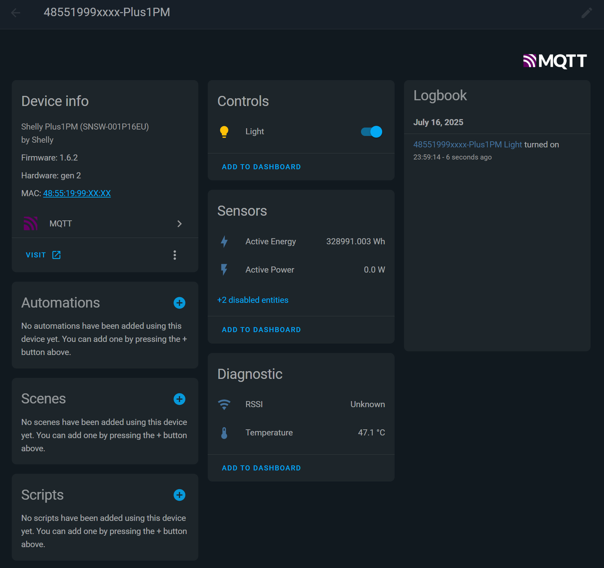

# Shelly Scripts

To install, copy the source code of the script, then add to Shelly device using one of Shelly provided options.

For your convenience, you can add following url to scripts source in your Shelly: 
```
https://raw.githubusercontent.com/michalk-k/shelly-scripts/main/manifest.json
```

Read documentation for further steps.

## MQTT DISCOVERY SELF

> It requires the MQTT to be enabled and configured in the Shelly device.

The script registers the Shelly device the script runs on and its entities, to Home Assistant, using MQTT discovery.\
It creates entities for all supported properties: switches, sensors etc.

Currently supports following SHelly components (they can be found in different SHelly devices):
* switch
* cover (incl. position and slat)
* pm1
* wifi <sup>*)</sup>
* em, em1
* emdata, em1data
* temperature <sup>**)</sup>

> **Important:** A lot of changes, like switch to cover, or enabling slat control for cover, requires running this script again, in order to register new features to MQTT discovery

Compatibility with devices depends on components those devices implement. Tested with following devices (click on them for screenshots): <details><summary>Mini PM gen3</summary>  </details><details><summary>Plus 1PM (gen2)</summary></details><details><summary>Plus 2PM (gen2)</summary></details><details><summary>Pro EM3 (gen2) - both triphase and monophase profiles</summary>**Triphase**  **Monophase**  </details>

<sup>*)</sup> wifi component isn't originally repoted to MQTT. This script adds periodical reporting of Wifi component status to topic configured in MQTT configuration <details><summary>screenshot</summary>  </details>
<sup>**)</sup> Shelly devices report temperature only on temperature changes. Once temperature stabilizes, MQTT topic is not updated anymore. In conjunction with non-retained topic, it might lead to unknown value for long time, ie after HA restart or HA entity reinitialization.

### Supported devices
✅ - confirmed by comparison of components implemented in the script

☑️ - as above, but support is limited to subset of available device profiles.

✔️ - tested by me

**Gen 2 devices**
| Device Name                     | Components                         | Supported |
| ------------------------------- | ---------------------------------- | ----------------- |
| Shelly Plus 1 (Mini)            | switch                             | ✅                 |
| Shelly Plus 1 PM (Mini)         | switch,                            | ✅  ✔️             |
| Shelly Plus 2 PM                | switch, cover                      | ✅ ✔️              |
| Shelly Plus I4                  | input                              | ✅                 |
| Shelly Plus Plug IT             | switch,                            | ✅                 |
| Shelly Plus Plug S              | switch,                            | ✅                 |
| Shelly Plus Plug UK             | switch,                            | ✅                 |
| Shelly Plus Plug US             | switch,                            | ✅                 |
| Shelly Plus H & T               | humidity, temperature, devicepower |                   |
| Shelly Plus Smoke               | smoke                              |                   |
| Shelly Plus WallDimmer          | light                              |                   |
| Shelly Plus RGBW PM             | light, rgb, rgbw                   |                   |
| Shelly Plus 0 – 10 V Dimmer     | light                              |                   |
| Shelly Plus PM Mini             | switch, pm1                        | ✅                 |
| Shelly Plus Uni                 | switch, temperature, humidity, voltmeter  |  ☑️ (switch only)   |
| Shelly Pro 1                    | switch                             | ✅                 |
| Shelly Pro 1 PM                 | switch                             | ✅                 |
| Shelly Pro 2                    | switch                             | ✅                 |
| Shelly Pro 2 PM                 | switch, cover                      | ✅   |
| Shelly Pro 3                    | switch                             | ✅                 |
| Shelly Pro 4 PM                 | switch                             | ✅                 |
| Shelly Pro Dual Cover PM        | cover                              | ✅                 |
| Shelly Pro EM                   | switch, em1, em1data               | ✅                 |
| Shelly Pro 3 EM (400)           | em, em1, emdata, em1data           | ✅ ✔️              |
| Shelly Pro Dimmer 1 PM          | light                              |                   |
| Shelly Pro Dimmer 2 PM          | light                              |                   |
| Shelly Pro Dimmer 0/1 – 10 V PM | light                              |                   |
| Shelly Pro RGBWW PM             | light, rgb, cct                    |                   |
| Shelly BLU Gateway              | *(none)*                           |                   |


**Gen 3 devices**
| Device Name                 | Components                         | Supported |
| --------------------------- | ---------------------------------- | ----------------- |
| Shelly 1                    | switch                             | ✅                 |
| Shelly 1 PM                 | switch                             | ✅                 |
| Shelly 2 PM                 | switch, cover                      | ✅                 |
| Shelly I4 / I4DC            | input                              |                    |
| Shelly 1 L                  | switch                             | ✅                 |
| Shelly 2 L                  | switch                             | ✅                 |
| Shelly 1 Mini               | switch                             | ✅                 |
| Shelly 1 PM Mini            | switch                             | ✅                 |
| Shelly PM Mini              | pm1                                | ✅ ✔️              |
| Shelly AZ Plug              | switch                             | ✅                 |
| Shelly Plug S               | switch                             | ✅                 |
| Shelly Outdoor Plug S       | switch                             | ✅                 |
| Shelly Dimmer 0/1 – 10 V PM | light                              |                    |
| Shelly Dimmer               | light                              |                    |
| Shelly D Dimmer             | light                              |                    |
| Shelly H & T                | humidity, temperature, devicepower |                    |
| Shelly 3 EM                 | em, em1data                        | ✅                 |
| Shelly EM                   | em1, em1data                       | ✅                 |
| Shelly BLU Gateway Gen3     | *(none)*                           |                    |
| Shelly Shutter              | cover                      | | ✅


**Gen 4 devices**
| Device Name      | Components  | Supported |
| ---------------- | ----------- | ----------------- |
| Shelly 1         | switch      | ✅                 |
| Shelly 1 PM      | switch      | ✅                 |
| Shelly 1 Mini    | switch      | ✅                 |
| Shelly 1 PM Mini | switch      | ✅                 |
| Shelly 2 PM      | switch      | ✅                 |


### Features
* easy to use: just run it
* by default creates generic device and entity names (see Naming below)
* device and entity names might be overriden by shelly device configuration (device name and channel names)
* switch can be reported as a light entity to HA (set `consumption type` to `light`)
* some of sensors are disabled by default, for example power factor or voltage.
* The script follows recent Home Assistant conventions in how to setup entities.
* force MQTT refresh to selected components, incl. WiFi


### Naming

**Device**

The device name follows the pattern: : `macaddress-modelname`, for example `b8d6xxxxxxxx-Plus2PM`.\
It can be overriden by setting Device name (Settings / Device Name). To apply changes, the script must be restarted

> Note, the Home Assistant uses device name as a prefix for entity names. Changing device when entities are already registered, affect no entity names

**Entities**

By default **entity name** follows the tracked attribute function, for example: `Switch`, `Frequency`, `Power Factor`, `RSSI`. If the device contains more components of the same type (ie measurement channels), the names are suffixed by oridinal numbers, for example `Switch 1`, `Switch 2`, `Frequency 1`, `Frequency 2`, etc.

If device channel has a custom name configured (as for example, `Output -> Name` in Shelly2PM), all related entity names gets name as follows: `Custom Name Function`, For example `Dryer Socket Frequency`. in this case the oridinal number of Shelly component is not appended.

The **friendly_name** is created by Home Assistant from the device name and the entity name. It might look like `b8d6xxxxxxxx-Plus2PM Active Power 2` or `b8d6xxxxxxxx-Plus2PM Backlight`. Looks horrible, but once device name is changed to something meaningfull, ie AlcoveLight, the friendly name will turn into `AlcoveLight Active Power 2` or `AlcoveLight Backlight` respectively.

The **unique_id** allways follows the pattern: `macaddress-function` or `macaddress-function-number`, for example `macaddress-rssi` or `b8d6xxxxxxxx_power_factor_1`. Unique id never changes and is not influenced by configuration settings.

The **entity_id** is not set by this script. The entity name is generated by Home Assistant from `device_name_entity_name` pattern, for example `sensor.b8d61a89xxxx_plus2pm_active_energy_2`. The `entity_id` may be influenced by the Device name set in Shelly configuration or changed later on in Home Assistant.

### Alternative Device Class
It's often useful to have a switch interpreted by Home Assistant as a light.

It can be achieved in Home Assistant with use of "Change device type of a switch" helper. But it creates additional entity in the system.

Shelly devices allows to enter this information into `(Output Settings -> Consumption Type)`. Entering `light` makes the switch be reported as a light to Home Assistant.

> Currently only `light` as alternative device class is supported

Note, that the change neither influences `unique_id`, `entity_id` or mqtt topic names. But it will change the `entity name` and `friendly name` of the entity.