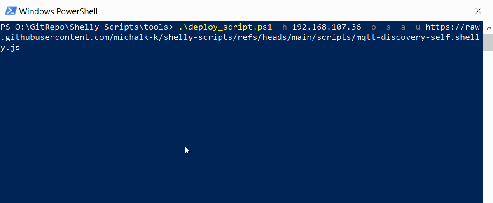

# Deploy script

The script downloads a shelly script from any URL (ie GitHub) and uploads it to a Shelly device via RPC API.

**Features**
* Bash and PowerShell version
* chunked uploads, 
* option to set autostart
* option to run after upload
* recognize already uploaded script by its name to overwrite it, if requested.
* shows progress

## Installation

Download script from the repo:

* Bash version: [click](./deploy_script.sh)
* PowerShell version: [click](./deploy_script.ps1)

## Usage

`deploy_script -u <github_url> -h <device_ip> [-a] [-s] [-o]`

*Parameters:*

```
-u: URL (required)"
-h: Device IP address (required)"
-a: Enable autostart (flag)
-s: Start after upload (flag)
-o: Overwrite existing script (flag)
```

## Demo


